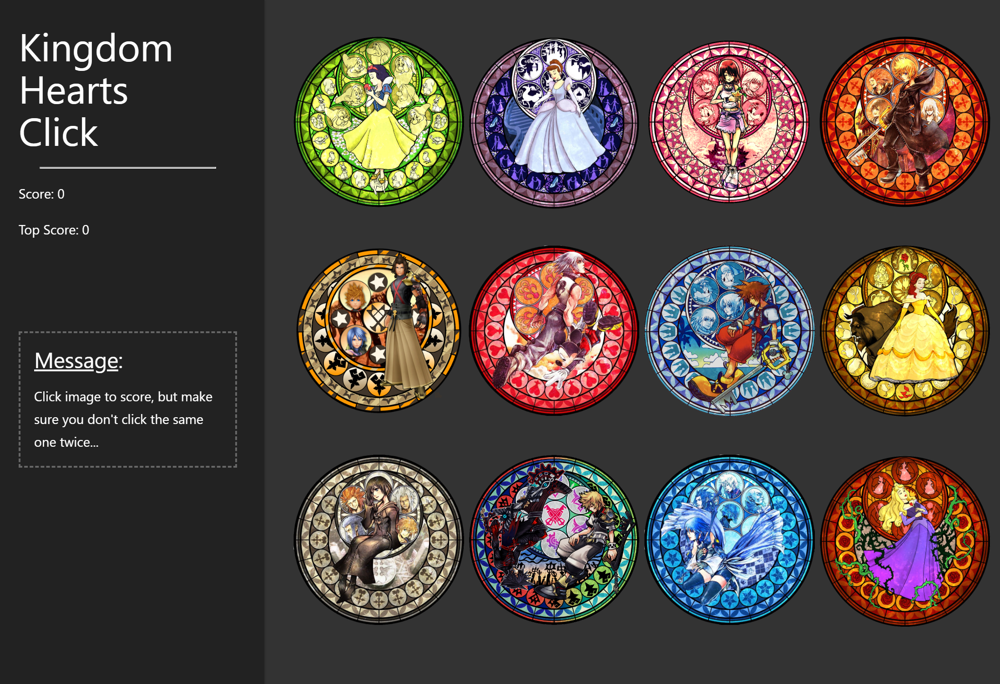

# Kingdom Hearts Memeory Click Game

### Clicky Game Preview:



## Getting Started

### Prerequisites
- Node.js (version 14.x or 16.x recommended)
- npm (comes with Node.js)

### Installation and Setup

1. Clone the repository:
   ```bash
   git clone https://github.com/kitkat0202/clicky.git
   cd clicky
   ```

2. Install the dependencies:
   ```bash
   npm install
   ```

3. Start the development server:
   ```bash
   npm start
   ```

4. Open your browser and navigate to `http://localhost:3000` to view the game.

### Available Scripts

- `npm start` - Runs the app in development mode
- `npm run build` - Builds the app for production
- `npm test` - Launches the test runner
- `npm run deploy` - Deploys the app to GitHub Pages

## Game Instructions

1. Create a new React application using [Create React App](https://github.com/facebookincubator/create-react-app).

2. The application should render different images (of your choice) to the screen. Each image should listen for click events.

3. The application should keep track of the user's score. The user's score should be incremented when clicking an image for the first time. The user's score should be reset to 0 if they click the same image more than once.

4. Every time an image is clicked, the images rendered to the page should shuffle themselves in a random order.

5. Once the user's score is reset after an incorrect guess, the game should restart.
